## Данный проект является моим вторым опытом работы с GUI на Python

Используемые библиотеки:

1. Pygame
2. Pygame_menu
3. Pygame_widgets
4. Tkinter
5. Pyinstaller
6. Subprocess

Перед запуском необходимо инсталлировать Python и установить с помощью "pip install <>" данные библиотеки,
файлы .whl для windows 64-bit, используемые мною (версии актуальные на 13.07.23), находятся в папке **libs**.

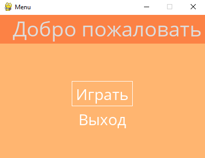

Меню реализовано с помощью Pygame_menu на базе Pygame, использован шаблон с сайта библиотеки, кастомизирована тема меню, добавлены необходимые и убраны ненужные пункты. 

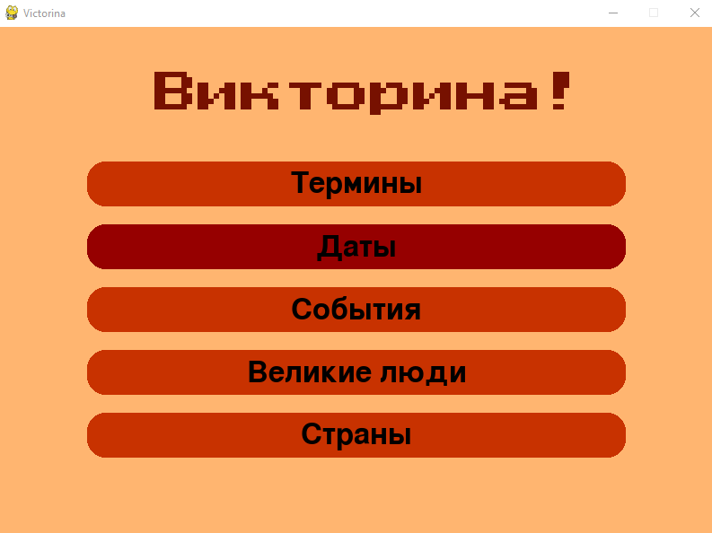 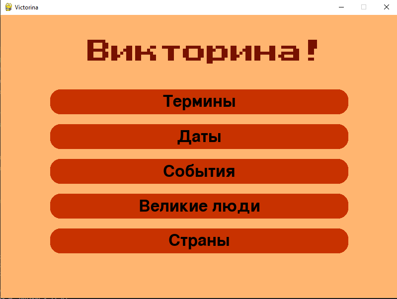

Основное окно викторины выполнено на Pygame с использованием Pygame_widgets для создания и кастомизации кнопок. Работает смена цвета при наведении и нажатии, шрифт заголовка с googleFonts. 


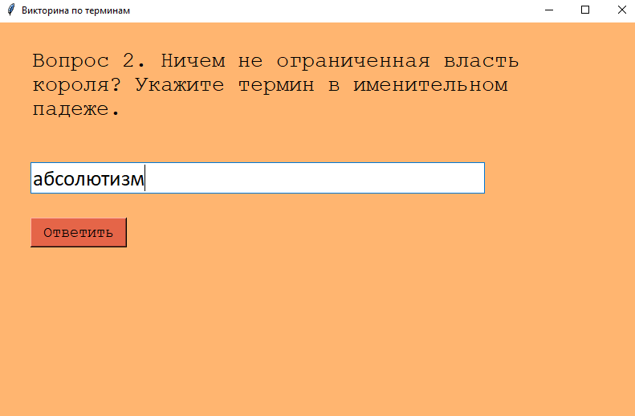 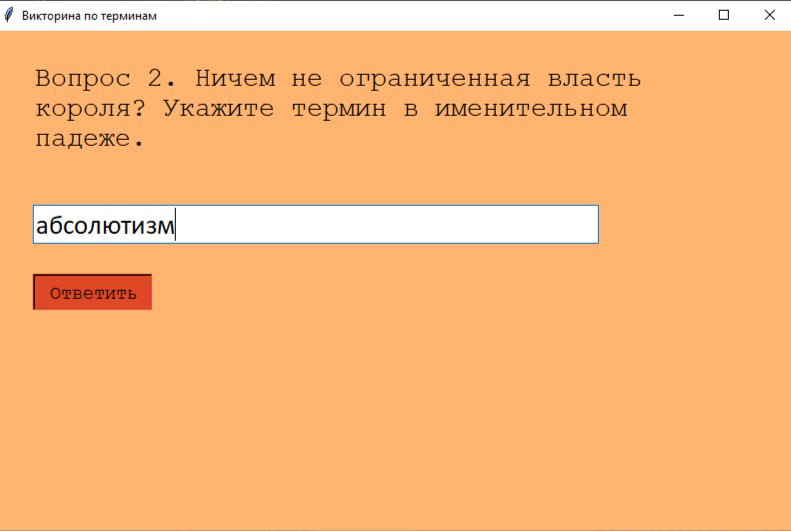

Сами викторины выполнены с помощью Tkinter, так как возникли трудности с реализацией дополнительного дисплея на Pygame. Они упакованы в .exe-приложения с помощью Pyinstaller, так как с помощью библиотек sys и os открытие-компилирование .py-файлов не вышло.
Поэтому при изменении .py файла нужно переупаковывать его в .exe, чтобы изменения применились и к самому приложению.
Вызов приложений из основного окна осуществляется через встроенную библиотеку Subprocess через функции, привязанные к кнопкам.

Команда для форматирования файла из .py в .exe
```
pyinstaller --onefile example.py
```

В результате пользователь получает свой результат - количество очков и приблизительную оценку знаний.
До 20% - от 20% до 50% - от 50% до 80% - от 80% до 100% - 100%.

Варианты результата.

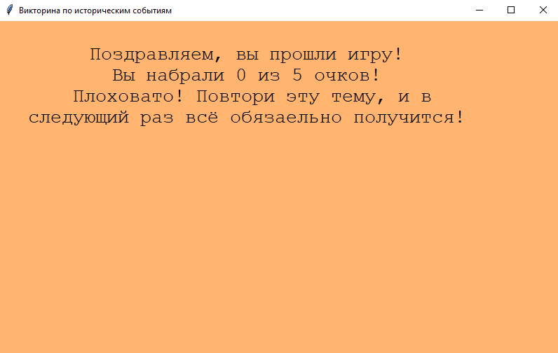

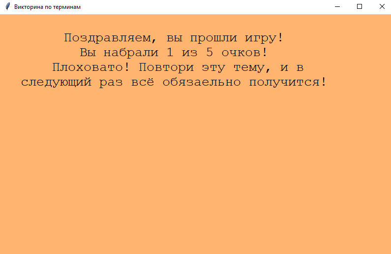

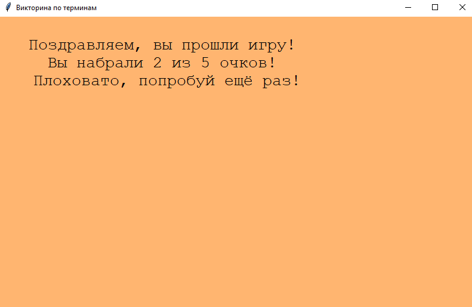

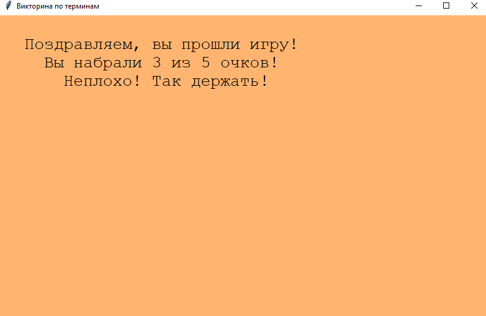

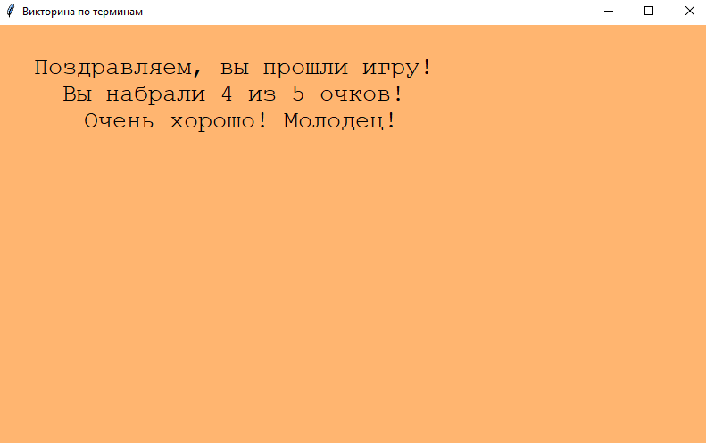

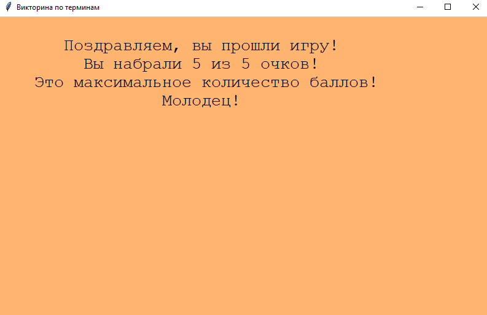

Таким образом, этот хобби-проект помог мне более тщательно разобраться с разработкой GUI в Python, а также освоить основы разработки игр с помощью Pygame.
